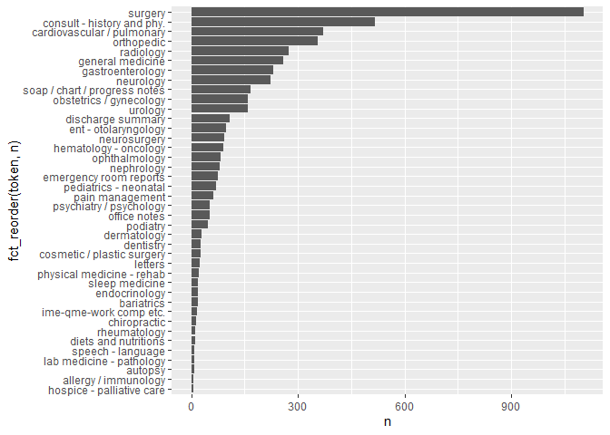
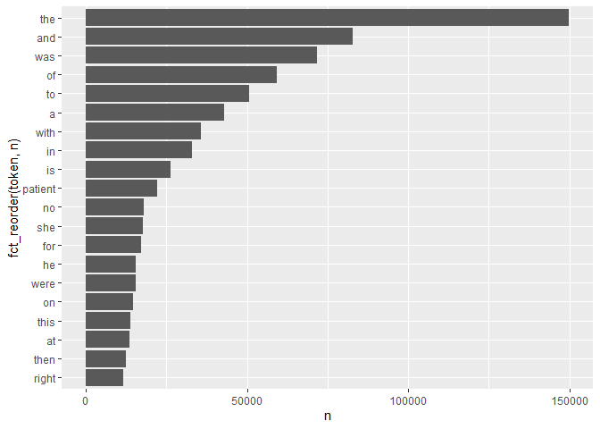
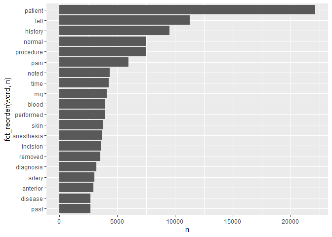

```r
library(dplyr)
```

```
## Warning: package 'dplyr' was built under R version 4.0.5
```

```
## 
## Attaching package: 'dplyr'
```

```
## The following objects are masked from 'package:stats':
## 
##     filter, lag
```

```
## The following objects are masked from 'package:base':
## 
##     intersect, setdiff, setequal, union
```

```r
library(ggplot2)
```

```
## Warning: package 'ggplot2' was built under R version 4.0.5
```

```r
library(tidytext)
library(tidyverse)
```

```
## Warning: package 'tidyverse' was built under R version 4.0.5
```

```
## -- Attaching packages --------------------------------------- tidyverse 1.3.1 --
```

```
## v tibble  3.1.4     v purrr   0.3.4
## v tidyr   1.1.3     v stringr 1.4.0
## v readr   2.0.1     v forcats 0.5.1
```

```
## Warning: package 'tibble' was built under R version 4.0.5
```

```
## Warning: package 'tidyr' was built under R version 4.0.5
```

```
## Warning: package 'readr' was built under R version 4.0.5
```

```
## Warning: package 'purrr' was built under R version 4.0.3
```

```
## Warning: package 'stringr' was built under R version 4.0.5
```

```
## Warning: package 'forcats' was built under R version 4.0.5
```

```
## -- Conflicts ------------------------------------------ tidyverse_conflicts() --
## x dplyr::filter() masks stats::filter()
## x dplyr::lag()    masks stats::lag()
```


```r
mtsamples <-"mtsamples.csv"
if(!file.exists(mtsamples))
  download.file("https://raw.githubusercontent.com/USCbiostats/data-science-data/master/00_mtsamples/mtsamples.csv",destfile = mtsamples)
mtsamples<-read.csv("mtsamples.csv")
```

## Question 1: What specialties do we have?

```r
count(mtsamples)
```

```
##      n
## 1 4999
```

```r
cat<-mtsamples %>%
  unnest_tokens(token, medical_specialty,token = "sentences") %>%
  count(token)
sum(cat$n)
```

```
## [1] 4999
```

```r
mtsamples %>%
  unnest_tokens(token, medical_specialty,token = "sentences") %>%
  count(token) %>%
  ggplot(aes(n, fct_reorder(token, n))) +
  geom_col()
```

<!-- -->

## Question 2

```r
Q2<-mtsamples %>%
  unnest_tokens(token, transcription) %>%
  count(token) %>%
  top_n(20,n)
Q2
```

```
##      token      n
## 1        a  42810
## 2      and  82779
## 3       at  13492
## 4      for  17049
## 5       he  15542
## 6       in  32807
## 7       is  26378
## 8       no  17874
## 9       of  59205
## 10      on  14694
## 11 patient  22131
## 12   right  11587
## 13     she  17593
## 14     the 149888
## 15    then  12430
## 16    this  13949
## 17      to  50632
## 18     was  71765
## 19    were  15535
## 20    with  35815
```


```r
Q2 %>%
  ggplot(aes(n, fct_reorder(token, n))) +
  geom_col()
```

<!-- -->
## Question 3
Method 1 

```r
# Create dataframe
num<-data.frame(word=as.character(c(0:23024)), lexicon = "SMART",row.names = NULL)
Q3<-mtsamples %>%
  unnest_tokens(word, transcription) %>%
  anti_join(stop_words, by = c("word")) %>%
  anti_join(num, by = c("word")) %>%
  count(word, sort = TRUE) %>%
  top_n(20,n)
```
Plot

```r
Q3 %>%
  ggplot(aes(n, fct_reorder(word, n))) +
  geom_col()
```

<!-- -->

Method 2

```r
mtsamples %>%
  unnest_tokens(output = word, input = transcription) %>%
  count(word,sort=TRUE)%>%
  anti_join(stop_words,by="word") %>%
  filter(!grepl(pattern = "^[0-9]+$", x=word)) %>%
  top_n(20) %>%
  ggplot(aes(x=n,y=fct_reorder(word,n)))+
  geom_col()
```

```
## Selecting by n
```

<!-- -->


## Question 4
Bi-grams

```r
Q4_bi<-mtsamples %>%
  unnest_ngrams(bigram, transcription, n = 2) %>%
  count(bigram, sort = TRUE) %>%
  top_n(20,n)
Q4_bi
```

```
##         bigram     n
## 1  the patient 20364
## 2       of the 19062
## 3       in the 12790
## 4       to the 12374
## 5     was then  6956
## 6      and the  6350
## 7  patient was  6293
## 8    the right  5509
## 9       on the  5241
## 10    the left  4860
## 11      with a  4857
## 12  history of  4537
## 13       to be  4345
## 14        is a  4014
## 15    with the  4002
## 16    there is  3950
## 17      at the  3657
## 18   there was  3334
## 19  patient is  3332
## 20  was placed  3328
```
Plot

```r
Q4_bi %>%
  ggplot(aes(n, fct_reorder(bigram, n))) +
  geom_col()
```

<!-- -->

Tri-grams

```r
Q4_tri<-mtsamples %>%
  unnest_ngrams(trigram, transcription, n = 3) %>%
  count(trigram, sort = TRUE) %>%
  top_n(20,n)
Q4_tri
```

```
##                    trigram    n
## 1          the patient was 6104
## 2           the patient is 3075
## 3               as well as 2243
## 4              there is no 1678
## 5       the operating room 1532
## 6             patient is a 1491
## 7       prepped and draped 1490
## 8              was used to 1480
## 9            and draped in 1372
## 10            at this time 1333
## 11         the patient has 1300
## 12        to the operating 1156
## 13           placed in the 1141
## 14          no evidence of 1132
## 15            was taken to 1108
## 16            there was no 1089
## 17 tolerated the procedure 1066
## 18    past medical history 1063
## 19      history of present 1056
## 20      of present illness 1038
## 21            of the right 1038
## 22           was placed in 1038
```

Plot

```r
Q4_tri%>%
  ggplot(aes(n, fct_reorder(trigram, n))) +
  geom_col()
```

<!-- -->

## Question 5

```r
Q5_bi<-mtsamples %>%
  unnest_ngrams(output = bigram, input = transcription, n=2) %>%
  separate(bigram, into=c("W1","W2"),sep=" ") 
```


```r
Q5_bi %>%
  select(W1,W2) %>%
  filter(W1=="history") %>%
  count(W2,sort=TRUE)
```

```
##                   W2    n
## 1                 of 4537
## 2                the  761
## 3                she  279
## 4                 he  227
## 5        significant  200
## 6               this  200
## 7                and  197
## 8                  1  181
## 9                 is  172
## 10   noncontributory  121
## 11           patient  101
## 12                no   99
## 13          negative   96
## 14          positive   87
## 15              none   76
## 16                as   72
## 17      unremarkable   53
## 18      hypertension   50
## 19             there   49
## 20          includes   47
## 21            mother   43
## 22               her   42
## 23           history   42
## 24                 a   39
## 25               was   35
## 26               his   34
## 27          reviewed   34
## 28          diabetes   32
## 29            social   31
## 30            denies   29
## 31            family   27
## 32              past   26
## 33            father   25
## 34                in   25
## 35        remarkable   25
## 36                mr   22
## 37         otherwise   22
## 38           unknown   22
## 39          coronary   21
## 40               not   20
## 41    nonsignificant   17
## 42               who   17
## 43       essentially   16
## 44                ms   15
## 45         pertinent   15
## 46          physical   15
## 47      appendectomy   14
## 48           nothing   14
## 49            asthma   13
## 50                on   13
## 51            review   13
## 52   cholecystectomy   12
## 53              from   12
## 54             lives   12
## 55       medications   12
## 56               per   12
## 57              that   12
## 58              back   11
## 59               for   11
## 60             right   11
## 61              with   11
## 62                at   10
## 63               but   10
## 64         currently   10
## 65                 i   10
## 66          obtained   10
## 67             prior   10
## 68            status   10
## 69              both    9
## 70            hernia    9
## 71           include    9
## 72           notable    9
## 73            please    9
## 74         pulmonary    9
## 75     questionnaire    9
## 76            strong    9
## 77              also    8
## 78            atrial    8
## 79         bilateral    8
## 80                 c    8
## 81            denied    8
## 82              left    8
## 83           marital    8
## 84           married    8
## 85           related    8
## 86         surgeries    8
## 87                we    8
## 88              born    7
## 89              copd    7
## 90             dates    7
## 91        especially    7
## 92           gravida    7
## 93        metastatic    7
## 94             other    7
## 95           parents    7
## 96           surgery    7
## 97              turp    7
## 98             which    7
## 99                 3    6
## 100              can    6
## 101        childhood    6
## 102          further    6
## 103              has    6
## 104             here    6
## 105        including    6
## 106               it    6
## 107             need    6
## 108           parent    6
## 109          reveals    6
## 110        unchanged    6
## 111              abc    5
## 112              are    5
## 113             baby    5
## 114             date    5
## 115             form    5
## 116     hysterectomy    5
## 117            lower    5
## 118            noted    5
## 119        patient's    5
## 120         surgical    5
## 121           taking    5
## 122         actually    4
## 123               af    4
## 124              all    4
## 125         although    4
## 126               av    4
## 127        basically    4
## 128          chronic    4
## 129        discussed    4
## 130              due    4
## 131         everyone    4
## 132        extensive    4
## 133             foot    4
## 134             have    4
## 135        illnesses    4
## 136             last    4
## 137           listed    4
## 138          looking    4
## 139         maternal    4
## 140              mom    4
## 141         multiple    4
## 142               or    4
## 143        pregnancy    4
## 144         prostate    4
## 145         provided    4
## 146           reason    4
## 147         reflects    4
## 148         remained    4
## 149            shows    4
## 150       suggestive    4
## 151         symptoms    4
## 152    tonsillectomy    4
## 153            tubal    4
## 154              two    4
## 155           unable    4
## 156     unobtainable    4
## 157             what    4
## 158             adhd    3
## 159          ascites    3
## 160          because    3
## 161        beginning    3
## 162          cardiac    3
## 163     circumcision    3
## 164            colon    3
## 165            comes    3
## 166              dad    3
## 167             does    3
## 168           except    3
## 169                g    3
## 170               g1    3
## 171          gastric    3
## 172       historical    3
## 173       huntington    3
## 174               if    3
## 175    immunizations    3
## 176     longstanding    3
## 177           lumbar    3
## 178             mild    3
## 179     nonoperative    3
## 180        nonsmoker    3
## 181           noting    3
## 182              now    3
## 183         paternal    3
## 184             peho    3
## 185        performed    3
## 186        placement    3
## 187         possible    3
## 188        regarding    3
## 189       reportedly    3
## 190         sciatica    3
## 191             they    3
## 192           though    3
## 193       throughout    3
## 194              xyz    3
## 195            years    3
## 196               30    2
## 197               38    2
## 198               40    2
## 199               51    2
## 200               69    2
## 201         abnormal    2
## 202            about    2
## 203           active    2
## 204         advanced    2
## 205             af's    2
## 206         allergic    2
## 207        allergies    2
## 208           anemia    2
## 209          anxiety    2
## 210            apart    2
## 211         aplastic    2
## 212        arthritis    2
## 213     arthroscopic    2
## 214      atelectasis    2
## 215            based    2
## 216           benign    2
## 217          briefly    2
## 218          brother    2
## 219               by    2
## 220              cad    2
## 221           cannot    2
## 222          central    2
## 223         cesarean    2
## 224            chest    2
## 225       compatible    2
## 226         consider    2
## 227       consistent    2
## 228       consisting    2
## 229           cookie    2
## 230         cosmetic    2
## 231       craniotomy    2
## 232          current    2
## 233             cyst    2
## 234                d    2
## 235            daily    2
## 236          despite    2
## 237         detailed    2
## 238          details    2
## 239  developmentally    2
## 240       diagnostic    2
## 241          distant    2
## 242               dm    2
## 243     dysrhythmias    2
## 244           eczema    2
## 245         elevated    2
## 246              end    2
## 247         episodic    2
## 248        essential    2
## 249            every    2
## 250       excisional    2
## 251         father's    2
## 252           female    2
## 253         findings    2
## 254            first    2
## 255               g3    2
## 256      gallbladder    2
## 257 gastrointestinal    2
## 258    genitourinary    2
## 259             gerd    2
## 260             goes    2
## 261      grandmother    2
## 262              had    2
## 263             half    2
## 264          hearing    2
## 265            heart    2
## 266        hepatitis    2
## 267             high    2
## 268              hip    2
## 269              hiv    2
## 270          however    2
## 271              htn    2
## 272   hyperlipidemia    2
## 273       impression    2
## 274         included    2
## 275        inpatient    2
## 276              ivc    2
## 277             knee    2
## 278               l5    2
## 279       laboratory    2
## 280          limited    2
## 281           little    2
## 282              lmp    2
## 283             long    2
## 284       lumpectomy    2
## 285      menorrhagia    2
## 286               mi    2
## 287  musculoskeletal    2
## 288       neurologic    2
## 289              non    2
## 290               ob    2
## 291          obesity    2
## 292             only    2
## 293   osteoarthritis    2
## 294          overall    2
## 295             pain    2
## 296     palpitations    2
## 297        parkinson    2
## 298           pelvic    2
## 299         permcath    2
## 300         personal    2
## 301    plagiocephaly    2
## 302         possibly    2
## 303         previous    2
## 304         probable    2
## 305     psychosocial    2
## 306             ptsd    2
## 307     questionable    2
## 308             quit    2
## 309         reactive    2
## 310           recent    2
## 311          records    2
## 312            refer    2
## 313            renal    2
## 314          resided    2
## 315      respiratory    2
## 316             rule    2
## 317        screening    2
## 318         seasonal    2
## 319              see    2
## 320         seizures    2
## 321            sheet    2
## 322            shone    2
## 323        shortness    2
## 324         shoulder    2
## 325            since    2
## 326           sister    2
## 327            smoke    2
## 328           smokes    2
## 329          smoking    2
## 330             some    2
## 331      spontaneous    2
## 332            still    2
## 333         strongly    2
## 334        substance    2
## 335          suggest    2
## 336       surgically    2
## 337       thereafter    2
## 338               to    2
## 339          tobacco    2
## 340            today    2
## 341     tuberculosis    2
## 342        underwent    2
## 343       unemployed    2
## 344         ureteral    2
## 345             used    2
## 346          uterine    2
## 347            vital    2
## 348             were    2
## 349               50    1
## 350             abcd    1
## 351   adenocarcinoma    1
## 352               an    1
## 353       biological    1
## 354         caffeine    1
## 355            edema    1
## 356          femoral    1
## 357            fever    1
## 358          general    1
## 359          genetic    1
## 360   hepatocellular    1
## 361          medical    1
## 362             mone    1
## 363           peptic    1
## 364            plans    1
## 365          steroid    1
## 366       subjective    1
## 367          summary    1
## 368        treatment    1
## 369             zero    1
```


```r
Q5_bi %>%
  select(W1,W2) %>%
  filter(W2=="history") %>%
  count(W1,sort=TRUE)
```

```
##                     W1    n
## 1              medical 1223
## 2               family  941
## 3                    a  939
## 4               social  865
## 5             surgical  491
## 6                   no  473
## 7                 with  163
## 8                  any  129
## 9                brief  125
## 10                 the  107
## 11                pain   98
## 12         psychiatric   90
## 13               prior   87
## 14                   2   80
## 15                past   80
## 16                 has   78
## 17            previous   72
## 18                 and   68
## 19                 his   61
## 20                long   56
## 21            personal   55
## 22                   3   54
## 23            clinical   52
## 24                   4   45
## 25                 for   45
## 26                year   45
## 27             history   42
## 28                none   39
## 29                 her   38
## 30               month   35
## 31                 day   32
## 32                   5   31
## 33           patient's   31
## 34       developmental   29
## 35             disease   29
## 36             smoking   29
## 37               known   28
## 38              remote   27
## 39                week   27
## 40                   7   24
## 41               local   24
## 42             cardiac   23
## 43                diet   23
## 44        longstanding   23
## 45                   6   22
## 46                   1   21
## 47              cancer   21
## 48                foot   21
## 49               birth   20
## 50          medication   20
## 51                  by   19
## 52               above   18
## 53             factors   18
## 54             general   18
## 55               legal   18
## 56              recent   18
## 57             alcohol   17
## 58             failure   17
## 59        hypertension   17
## 60               other   17
## 61              denies   16
## 62            contrast   15
## 63                 had   15
## 64                 std   14
## 65             surgery   14
## 66                  cc   13
## 67            complete   13
## 68            interval   13
## 69                   8   12
## 70               abuse   12
## 71           diagnosis   12
## 72                 gyn   12
## 73                  or   12
## 74         significant   12
## 75               fever   11
## 76        neurological   11
## 77             patient   11
## 78            standing   11
## 79                also   10
## 80                days   10
## 81             distant   10
## 82              ocular   10
## 83              travel   10
## 84               adult    9
## 85              denied    9
## 86             further    9
## 87                 iii    9
## 88                 see    9
## 89                 ago    8
## 90             allergy    8
## 91                  as    8
## 92              biopsy    8
## 93               bleed    8
## 94             chronic    8
## 95                have    8
## 96                  is    8
## 97            lymphoma    8
## 98                  mi    8
## 99            position    8
## 100             sepsis    8
## 101           stenosis    8
## 102         ultrasound    8
## 103           vomiting    8
## 104                 11    7
## 105             anemia    7
## 106            current    7
## 107           fracture    7
## 108             health    7
## 109               knee    7
## 110        nutritional    7
## 111        obstetrical    7
## 112             status    7
## 113                 to    7
## 114             trauma    7
## 115               work    7
## 116              abc's    6
## 117          allergies    6
## 118             breath    6
## 119         depression    6
## 120             eating    6
## 121         evaluation    6
## 122       fibrillation    6
## 123           findings    6
## 124           followup    6
## 125      gynecological    6
## 126          hematuria    6
## 127       immunization    6
## 128            minutes    6
## 129            natural    6
## 130      psychological    6
## 131       questionable    6
## 132            syncope    6
## 133          treatment    6
## 134              tumor    6
## 135           weakness    6
## 136              weeks    6
## 137                  x    6
## 138                 12    5
## 139                 13    5
## 140                  9    5
## 141          admission    5
## 142           bleeding    5
## 143               case    5
## 144            complex    5
## 145              cough    5
## 146           daughter    5
## 147               drug    5
## 148                him    5
## 149               home    5
## 150               hour    5
## 151     hyperlipidemia    5
## 152         infarction    5
## 153      insufficiency    5
## 154           military    5
## 155                 ob    5
## 156             pelvis    5
## 157                per    5
## 158          pertinent    5
## 159           positive    5
## 160              thigh    5
## 161             weight    5
## 162              years    5
## 163           accurate    4
## 164          afternoon    4
## 165         anesthetic    4
## 166                arm    4
## 167               back    4
## 168          breathing    4
## 169          carcinoma    4
## 170     cardiovascular    4
## 171         cellulitis    4
## 172            checkup    4
## 173              chest    4
## 174       circumcision    4
## 175          complaint    4
## 176            consent    4
## 177         deficiency    4
## 178       dermatologic    4
## 179           diabetic    4
## 180          diagnoses    4
## 181          diaphragm    4
## 182           dictated    4
## 183        educational    4
## 184             filter    4
## 185                 gi    4
## 186               give    4
## 187              gives    4
## 188               good    4
## 189           headache    4
## 190              heent    4
## 191            herself    4
## 192     hypothyroidism    4
## 193             injury    4
## 194            interim    4
## 195           lethargy    4
## 196          mammogram    4
## 197         management    4
## 198           maternal    4
## 199        medications    4
## 200             mother    4
## 201    musculoskeletal    4
## 202         neurologic    4
## 203                 of    4
## 204           physical    4
## 205           prostate    4
## 206               rash    4
## 207           reported    4
## 208          resolving    4
## 209           seizures    4
## 210              sleep    4
## 211             stable    4
## 212             toilet    4
## 213          toothache    4
## 214              ulcer    4
## 215         underlying    4
## 216              urine    4
## 217               well    4
## 218                 檚    4
## 219                 10    3
## 220               2008    3
## 221           abraxane    3
## 222            abscess    3
## 223           academic    3
## 224           accident    3
## 225         additional    3
## 226         adjustment    3
## 227               bait    3
## 228            bedside    3
## 229             breast    3
## 230       chemotherapy    3
## 231 cholangiocarcinoma    3
## 232      ciprofloxacin    3
## 233            colitis    3
## 234        compression    3
## 235               cord    3
## 236           coumadin    3
## 237         counseling    3
## 238               cpap    3
## 239  craniopharyngioma    3
## 240                cva    3
## 241              daily    3
## 242           detailed    3
## 243           earaches    3
## 244           economic    3
## 245            ecstasy    3
## 246           elevated    3
## 247     encephalopathy    3
## 248          extension    3
## 249           familial    3
## 250               full    3
## 251         functional    3
## 252        gastrostomy    3
## 253              heads    3
## 254              heavy    3
## 255           hospital    3
## 256           insomnia    3
## 257    instrumentation    3
## 258            jerking    3
## 259             joints    3
## 260         laceration    3
## 261            lesions    3
## 262              meals    3
## 263              media    3
## 264                 mg    3
## 265           negative    3
## 266     osteoarthritis    3
## 267       paracentesis    3
## 268               plan    3
## 269          pneumonia    3
## 270          potential    3
## 271             pounds    3
## 272     preoperatively    3
## 273           pressure    3
## 274             rashes    3
## 275            refills    3
## 276           relevant    3
## 277        requirement    3
## 278               room    3
## 279                 s1    3
## 280          screening    3
## 281            seizure    3
## 282             strong    3
## 283            support    3
## 284           syndrome    3
## 285        temperature    3
## 286   thrombocytopenia    3
## 287                toe    3
## 288               toes    3
## 289        transfusion    3
## 290         transplant    3
## 291               tube    3
## 292            urinate    3
## 293                use    3
## 294              vague    3
## 295         xerostomia    3
## 296                 17    2
## 297                 19    2
## 298               1980    2
## 299               2007    2
## 300                650    2
## 301                 85    2
## 302              about    2
## 303           acromion    2
## 304       adenosarcoma    2
## 305        anesthetics    2
## 306             angina    2
## 307              ankle    2
## 308            anxiety    2
## 309              apnea    2
## 310        appointment    2
## 311             artery    2
## 312       arthroplasty    2
## 313         assessment    2
## 314           azotemia    2
## 315         bacteremia    2
## 316           biopsies    2
## 317            bladder    2
## 318                bnp    2
## 319              brace    2
## 320              bursa    2
## 321             button    2
## 322           calculus    2
## 323           cataract    2
## 324              cecum    2
## 325              check    2
## 326          childhood    2
## 327          cirrhosis    2
## 328              clear    2
## 329           clearcut    2
## 330                cns    2
## 331      complications    2
## 332          component    2
## 333          condition    2
## 334         conditions    2
## 335            condyle    2
## 336            consult    2
## 337       consultation    2
## 338               copd    2
## 339              cycle    2
## 340         cystoscopy    2
## 341         defecation    2
## 342             deflux    2
## 343           delivery    2
## 344           dementia    2
## 345         department    2
## 346          describes    2
## 347        development    2
## 348         disability    2
## 349         discovered    2
## 350               disk    2
## 351        disturbance    2
## 352               dome    2
## 353               done    2
## 354           drainage    2
## 355               drip    2
## 356              drops    2
## 357              drugs    2
## 358          duramorph    2
## 359                eeg    2
## 360           effusion    2
## 361                ekg    2
## 362           embolism    2
## 363          emphysema    2
## 364        epilepticus    2
## 365      erythematosus    2
## 366        established    2
## 367               exam    2
## 368            examine    2
## 369           exposure    2
## 370               fall    2
## 371             father    2
## 372           father's    2
## 373               ffdm    2
## 374              floor    2
## 375            flutter    2
## 376           foreskin    2
## 377          frequency    2
## 378           function    2
## 379          gastritis    2
## 380               gerd    2
## 381              given    2
## 382              glans    2
## 383             glioma    2
## 384                got    2
## 385                 gu    2
## 386        gynecologic    2
## 387     hallucinations    2
## 388             having    2
## 389             height    2
## 390        hematologic    2
## 391        hemiparesis    2
## 392         hemoptysis    2
## 393             heroin    2
## 394         hoarseness    2
## 395              hours    2
## 396                hpi    2
## 397     hydronephrosis    2
## 398   hypersensitivity    2
## 399        hypertrophy    2
## 400        hypotension    2
## 401          hypoxemia    2
## 402       hysterectomy    2
## 403             images    2
## 404         immaturity    2
## 405          immediate    2
## 406        immunologic    2
## 407          impaction    2
## 408           impaired    2
## 409         impression    2
## 410                 in    2
## 411          including    2
## 412          infection    2
## 413         injections    2
## 414                inr    2
## 415        instability    2
## 416             intact    2
## 417      interrogation    2
## 418         irritation    2
## 419                 it    2
## 420           jaundice    2
## 421             kidney    2
## 422           kyphosis    2
## 423               left    2
## 424                leg    2
## 425               legs    2
## 426           lifelong    2
## 427           ligation    2
## 428             little    2
## 429              liver    2
## 430           marcaine    2
## 431         mastectomy    2
## 432           mellitus    2
## 433       mesothelioma    2
## 434          metabolic    2
## 435         metastases    2
## 436               mgus    2
## 437         monitoring    2
## 438               much    2
## 439             murmur    2
## 440           mutation    2
## 441                 my    2
## 442               near    2
## 443             niacin    2
## 444              night    2
## 445            nodosum    2
## 446            nodules    2
## 447       noncompliant    2
## 448     nonoperatively    2
## 449             normal    2
## 450        obstruction    2
## 451       occupational    2
## 452               odor    2
## 453             office    2
## 454                old    2
## 455            ongoing    2
## 456             origin    2
## 457      osteomyelitis    2
## 458               pacu    2
## 459        palpitation    2
## 460       palpitations    2
## 461              panel    2
## 462                pap    2
## 463            patella    2
## 464           pectoris    2
## 465              penis    2
## 466             period    2
## 467            periods    2
## 468          placement    2
## 469               plus    2
## 470       polymyositis    2
## 471             polyps    2
## 472           possible    2
## 473       presentation    2
## 474       preventative    2
## 475            problem    2
## 476            profile    2
## 477              prone    2
## 478             proper    2
## 479            provide    2
## 480        psychologic    2
## 481          psychosis    2
## 482          pulmonary    2
## 483               rate    2
## 484             rectum    2
## 485            related    2
## 486            relates    2
## 487            removal    2
## 488            reports    2
## 489           resolved    2
## 490          retention    2
## 491        retinopathy    2
## 492           reversed    2
## 493                sac    2
## 494                sbp    2
## 495               scan    2
## 496        sensitivity    2
## 497                sex    2
## 498             sexual    2
## 499          shakiness    2
## 500              shaky    2
## 501              short    2
## 502              shunt    2
## 503               side    2
## 504            sinuses    2
## 505          sinusitis    2
## 506           sister's    2
## 507                 so    2
## 508      socioeconomic    2
## 509               some    2
## 510              spine    2
## 511             sprain    2
## 512              staff    2
## 513           stenting    2
## 514          stiffness    2
## 515             stroke    2
## 516          substance    2
## 517        substantial    2
## 518           suicidal    2
## 519              suite    2
## 520            swallow    2
## 521         swallowing    2
## 522           symptoms    2
## 523            teaches    2
## 524            tendons    2
## 525               test    2
## 526            testing    2
## 527              tests    2
## 528            therapy    2
## 529               this    2
## 530             thorax    2
## 531     thrombocytosis    2
## 532              thumb    2
## 533               tiva    2
## 534            tobacco    2
## 535              today    2
## 536        torticollis    2
## 537          twitching    2
## 538            unknown    2
## 539       unresponsive    2
## 540          urticaria    2
## 541          vaginitis    2
## 542               vera    2
## 543            voiding    2
## 544               wall    2
## 545            washers    2
## 546               wire    2
## 547                 wk    2
## 548               yyyy    2
## 549     administration    1
## 550       appendectomy    1
## 551          available    1
## 552               body    1
## 553         distracted    1
## 554          extensive    1
## 555               head    1
## 556               high    1
## 557                hip    1
## 558                icu    1
## 559            illness    1
## 560              joint    1
## 561             lesion    1
## 562               mass    1
## 563           morphine    1
## 564               neck    1
## 565             school    1
## 566          surgeries    1
## 567             tendon    1
```


```r
Q5_bi %>%
  filter(W1 == "history") %>%
  filter(!(W2 %in% stop_words$word) & !grepl(pattern = "^[0-9]+$", x=W2)) %>%
  count(W2,sort=TRUE) %>%
  top_n(10) %>%
  knitr::kable(caption = "Words after history")
```

```
## Selecting by n
```


Table: Words after history

|W2              |   n|
|:---------------|---:|
|significant     | 200|
|noncontributory | 121|
|patient         | 101|
|negative        |  96|
|positive        |  87|
|unremarkable    |  53|
|hypertension    |  50|
|includes        |  47|
|mother          |  43|
|history         |  42|


```r
Q5_bi %>%
  filter(W2 == "history") %>%
  filter(!(W1 %in% stop_words$word) & !grepl(pattern = "^[0-9]+$", x=W1)) %>%
  count(W1,sort=TRUE) %>%
  top_n(10) %>%
  knitr::kable(caption = "Words before history")
```

```
## Selecting by n
```


Table: Words before history

|W1          |    n|
|:-----------|----:|
|medical     | 1223|
|family      |  941|
|social      |  865|
|surgical    |  491|
|pain        |   98|
|psychiatric |   90|
|prior       |   87|
|past        |   80|
|previous    |   72|
|personal    |   55|

## Question 6
Most used

```r
# mtsamples %>%
#   unnest_tokens(word, transcription) %>%
#   group_by(medical_specialty) %>%
#   count(word,sort=TRUE) %>%
#   filter(!(word %in% stop_words$word) & !grepl(pattern = "^[0-9]+$", word)) %>%
#   top_n(1) %>%
#   arrange(medical_specialty,n) %>%
#   knitr::kable()
```


```r
most_used<-mtsamples %>%
  unnest_tokens(word, transcription) %>%
  anti_join(stop_words, by = c("word")) %>%
  anti_join(num, by = c("word")) %>%
  group_by(medical_specialty) %>%
  count(word, sort = TRUE) %>%
  top_n(1,n) %>%
  arrange(medical_specialty,n) %>%
  knitr::kable()
most_used
```


|medical_specialty             |word    |    n|
|:-----------------------------|:-------|----:|
|Allergy / Immunology          |history |   38|
|Autopsy                       |left    |   83|
|Bariatrics                    |patient |   62|
|Cardiovascular / Pulmonary    |left    | 1550|
|Chiropractic                  |pain    |  187|
|Consult - History and Phy.    |patient | 3057|
|Cosmetic / Plastic Surgery    |patient |  116|
|Dentistry                     |patient |  195|
|Dermatology                   |patient |  102|
|Diets and Nutritions          |patient |   46|
|Discharge Summary             |patient |  677|
|Emergency Room Reports        |patient |  694|
|Endocrinology                 |thyroid |  129|
|ENT - Otolaryngology          |patient |  415|
|Gastroenterology              |patient |  872|
|General Medicine              |patient | 1359|
|Hematology - Oncology         |patient |  316|
|Hospice - Palliative Care     |patient |   43|
|IME-QME-Work Comp etc.        |pain    |  152|
|Lab Medicine - Pathology      |cm      |   35|
|Lab Medicine - Pathology      |tumor   |   35|
|Letters                       |pain    |   80|
|Nephrology                    |patient |  348|
|Neurology                     |left    |  672|
|Neurosurgery                  |patient |  374|
|Obstetrics / Gynecology       |patient |  630|
|Office Notes                  |normal  |  230|
|Ophthalmology                 |eye     |  456|
|Orthopedic                    |patient | 1713|
|Pain Management               |patient |  236|
|Pediatrics - Neonatal         |patient |  248|
|Physical Medicine - Rehab     |patient |  220|
|Podiatry                      |foot    |  232|
|Psychiatry / Psychology       |patient |  532|
|Radiology                     |left    |  701|
|Rheumatology                  |history |   50|
|Sleep Medicine                |sleep   |  143|
|SOAP / Chart / Progress Notes |patient |  542|
|Speech - Language             |patient |  105|
|Surgery                       |patient | 4856|
|Urology                       |patient |  776|
Most 5 used

```r
# mtsamples %>%
#   unnest_tokens(word, transcription) %>%
#   group_by(medical_specialty) %>%
#   count(word,sort=TRUE) %>%
#   filter(!(word %in% stop_words$word) & !grepl(pattern = "^[0-9]+$", word)) %>%
#   top_n(5) %>%
#   arrange(medical_specialty,n) %>%
#   knitr::kable()
```


```r
most_5_used<-mtsamples %>%
  unnest_tokens(word, transcription) %>%
  anti_join(stop_words, by = c("word")) %>%
  anti_join(num, by = c("word")) %>%
  group_by(medical_specialty) %>%
  count(word, sort = TRUE) %>%
  top_n(5,n) %>%
  arrange(medical_specialty,n) %>%
  knitr::kable()
most_5_used
```


|medical_specialty             |word         |    n|
|:-----------------------------|:------------|----:|
|Allergy / Immunology          |nasal        |   13|
|Allergy / Immunology          |past         |   13|
|Allergy / Immunology          |allergies    |   21|
|Allergy / Immunology          |patient      |   22|
|Allergy / Immunology          |noted        |   23|
|Allergy / Immunology          |history      |   38|
|Autopsy                       |body         |   40|
|Autopsy                       |anterior     |   47|
|Autopsy                       |neck         |   55|
|Autopsy                       |inch         |   59|
|Autopsy                       |left         |   83|
|Bariatrics                    |gastric      |   30|
|Bariatrics                    |surgery      |   34|
|Bariatrics                    |weight       |   36|
|Bariatrics                    |history      |   50|
|Bariatrics                    |patient      |   62|
|Cardiovascular / Pulmonary    |history      |  654|
|Cardiovascular / Pulmonary    |coronary     |  681|
|Cardiovascular / Pulmonary    |artery       | 1085|
|Cardiovascular / Pulmonary    |patient      | 1532|
|Cardiovascular / Pulmonary    |left         | 1550|
|Chiropractic                  |left         |   54|
|Chiropractic                  |history      |   56|
|Chiropractic                  |dr           |   66|
|Chiropractic                  |patient      |   85|
|Chiropractic                  |pain         |  187|
|Consult - History and Phy.    |mg           |  908|
|Consult - History and Phy.    |pain         | 1153|
|Consult - History and Phy.    |normal       | 1368|
|Consult - History and Phy.    |history      | 2820|
|Consult - History and Phy.    |patient      | 3057|
|Cosmetic / Plastic Surgery    |incision     |   67|
|Cosmetic / Plastic Surgery    |skin         |   88|
|Cosmetic / Plastic Surgery    |breast       |   95|
|Cosmetic / Plastic Surgery    |procedure    |   98|
|Cosmetic / Plastic Surgery    |patient      |  116|
|Dentistry                     |procedure    |   82|
|Dentistry                     |left         |   94|
|Dentistry                     |teeth        |  104|
|Dentistry                     |tooth        |  108|
|Dentistry                     |patient      |  195|
|Dermatology                   |procedure    |   44|
|Dermatology                   |left         |   58|
|Dermatology                   |cm           |   77|
|Dermatology                   |skin         |  101|
|Dermatology                   |patient      |  102|
|Diets and Nutritions          |food         |   27|
|Diets and Nutritions          |plan         |   27|
|Diets and Nutritions          |day          |   28|
|Diets and Nutritions          |carbohydrate |   37|
|Diets and Nutritions          |weight       |   40|
|Diets and Nutritions          |patient      |   46|
|Discharge Summary             |hospital     |  183|
|Discharge Summary             |history      |  208|
|Discharge Summary             |mg           |  301|
|Discharge Summary             |discharge    |  358|
|Discharge Summary             |patient      |  677|
|Emergency Room Reports        |denies       |  149|
|Emergency Room Reports        |normal       |  255|
|Emergency Room Reports        |pain         |  273|
|Emergency Room Reports        |history      |  356|
|Emergency Room Reports        |patient      |  694|
|Endocrinology                 |dissection   |   45|
|Endocrinology                 |gland        |   45|
|Endocrinology                 |nerve        |   45|
|Endocrinology                 |history      |   57|
|Endocrinology                 |left         |   63|
|Endocrinology                 |patient      |  121|
|Endocrinology                 |thyroid      |  129|
|ENT - Otolaryngology          |procedure    |  181|
|ENT - Otolaryngology          |ear          |  182|
|ENT - Otolaryngology          |left         |  219|
|ENT - Otolaryngology          |nasal        |  281|
|ENT - Otolaryngology          |patient      |  415|
|Gastroenterology              |colon        |  240|
|Gastroenterology              |normal       |  328|
|Gastroenterology              |history      |  341|
|Gastroenterology              |procedure    |  470|
|Gastroenterology              |patient      |  872|
|General Medicine              |mg           |  503|
|General Medicine              |pain         |  567|
|General Medicine              |normal       |  717|
|General Medicine              |history      | 1027|
|General Medicine              |patient      | 1359|
|Hematology - Oncology         |mass         |   97|
|Hematology - Oncology         |mg           |  107|
|Hematology - Oncology         |left         |  187|
|Hematology - Oncology         |history      |  290|
|Hematology - Oncology         |patient      |  316|
|Hospice - Palliative Care     |family       |   19|
|Hospice - Palliative Care     |pain         |   19|
|Hospice - Palliative Care     |daughter     |   22|
|Hospice - Palliative Care     |history      |   27|
|Hospice - Palliative Care     |mg           |   28|
|Hospice - Palliative Care     |patient      |   43|
|IME-QME-Work Comp etc.        |left         |   70|
|IME-QME-Work Comp etc.        |injury       |   81|
|IME-QME-Work Comp etc.        |dr           |   82|
|IME-QME-Work Comp etc.        |patient      |  106|
|IME-QME-Work Comp etc.        |pain         |  152|
|Lab Medicine - Pathology      |upper        |   20|
|Lab Medicine - Pathology      |lobe         |   29|
|Lab Medicine - Pathology      |lymph        |   30|
|Lab Medicine - Pathology      |cm           |   35|
|Lab Medicine - Pathology      |tumor        |   35|
|Letters                       |dr           |   46|
|Letters                       |normal       |   53|
|Letters                       |patient      |   65|
|Letters                       |abc          |   71|
|Letters                       |pain         |   80|
|Nephrology                    |left         |  132|
|Nephrology                    |kidney       |  144|
|Nephrology                    |history      |  160|
|Nephrology                    |renal        |  257|
|Nephrology                    |patient      |  348|
|Neurology                     |time         |  278|
|Neurology                     |history      |  429|
|Neurology                     |normal       |  485|
|Neurology                     |patient      |  652|
|Neurology                     |left         |  672|
|Neurosurgery                  |left         |  222|
|Neurosurgery                  |procedure    |  247|
|Neurosurgery                  |c6           |  266|
|Neurosurgery                  |c5           |  289|
|Neurosurgery                  |patient      |  374|
|Obstetrics / Gynecology       |normal       |  276|
|Obstetrics / Gynecology       |incision     |  293|
|Obstetrics / Gynecology       |procedure    |  301|
|Obstetrics / Gynecology       |uterus       |  317|
|Obstetrics / Gynecology       |patient      |  630|
|Office Notes                  |noted        |   60|
|Office Notes                  |history      |   76|
|Office Notes                  |patient      |   94|
|Office Notes                  |negative     |  193|
|Office Notes                  |normal       |  230|
|Ophthalmology                 |chamber      |  149|
|Ophthalmology                 |anterior     |  150|
|Ophthalmology                 |procedure    |  176|
|Ophthalmology                 |patient      |  259|
|Ophthalmology                 |eye          |  456|
|Orthopedic                    |lateral      |  472|
|Orthopedic                    |procedure    |  669|
|Orthopedic                    |pain         |  763|
|Orthopedic                    |left         |  998|
|Orthopedic                    |patient      | 1713|
|Pain Management               |injected     |   76|
|Pain Management               |pain         |   76|
|Pain Management               |needle       |  156|
|Pain Management               |procedure    |  197|
|Pain Management               |patient      |  236|
|Pediatrics - Neonatal         |child        |   82|
|Pediatrics - Neonatal         |mom          |   82|
|Pediatrics - Neonatal         |normal       |  155|
|Pediatrics - Neonatal         |history      |  235|
|Pediatrics - Neonatal         |patient      |  248|
|Physical Medicine - Rehab     |history      |   54|
|Physical Medicine - Rehab     |motor        |   62|
|Physical Medicine - Rehab     |pain         |   95|
|Physical Medicine - Rehab     |left         |  104|
|Physical Medicine - Rehab     |patient      |  220|
|Podiatry                      |incision     |   96|
|Podiatry                      |tendon       |   98|
|Podiatry                      |left         |  137|
|Podiatry                      |patient      |  231|
|Podiatry                      |foot         |  232|
|Psychiatry / Psychology       |reported     |  141|
|Psychiatry / Psychology       |mother       |  164|
|Psychiatry / Psychology       |mg           |  183|
|Psychiatry / Psychology       |history      |  344|
|Psychiatry / Psychology       |patient      |  532|
|Radiology                     |mild         |  242|
|Radiology                     |exam         |  302|
|Radiology                     |patient      |  306|
|Radiology                     |normal       |  644|
|Radiology                     |left         |  701|
|Rheumatology                  |day          |   22|
|Rheumatology                  |examination  |   22|
|Rheumatology                  |joints       |   22|
|Rheumatology                  |pain         |   23|
|Rheumatology                  |mg           |   26|
|Rheumatology                  |patient      |   34|
|Rheumatology                  |history      |   50|
|Sleep Medicine                |stage        |   29|
|Sleep Medicine                |activity     |   31|
|Sleep Medicine                |apnea        |   35|
|Sleep Medicine                |patient      |   69|
|Sleep Medicine                |sleep        |  143|
|SOAP / Chart / Progress Notes |blood        |  194|
|SOAP / Chart / Progress Notes |pain         |  239|
|SOAP / Chart / Progress Notes |history      |  254|
|SOAP / Chart / Progress Notes |mg           |  302|
|SOAP / Chart / Progress Notes |patient      |  542|
|Speech - Language             |evaluation   |   17|
|Speech - Language             |goals        |   17|
|Speech - Language             |term         |   17|
|Speech - Language             |time         |   17|
|Speech - Language             |patient's    |   28|
|Speech - Language             |speech       |   35|
|Speech - Language             |therapy      |   41|
|Speech - Language             |patient      |  105|
|Surgery                       |incision     | 1641|
|Surgery                       |anesthesia   | 1687|
|Surgery                       |procedure    | 3243|
|Surgery                       |left         | 3263|
|Surgery                       |patient      | 4856|
|Urology                       |history      |  196|
|Urology                       |left         |  288|
|Urology                       |procedure    |  306|
|Urology                       |bladder      |  357|
|Urology                       |patient      |  776|

## Question 7
We can see that the word patient appears at a relatively high frequency. Furthermore, eye appears 456 times in Ophthalmology and tooth & teeth appear 212 times in total which also makes sense regard these medical specialties. 


